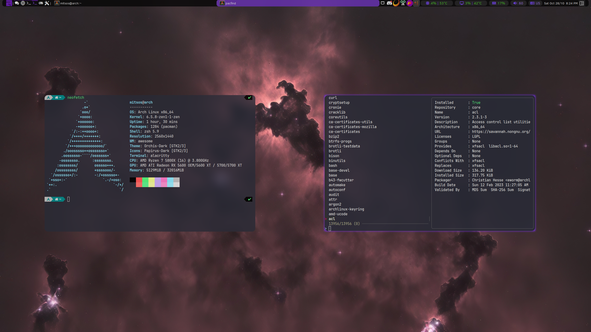

# dotfiles
A collection of my important dotfiles

Feel free to `Ctrl-C Ctrl-V` anything you like 😁




## Contents
- **alacritty**
    - Alacritty terminal config (mostly colors)
- **awesome**
    - AwesomeWM config with a lot of custom things _(see [here](#awesomewm-config) for more info)_
- **mpv**
    - Mpv config with the [uosc](https://github.com/tomasklaen/uosc) theme
- **rofi**
    - Rofi config
- **Thunar**
    - Thunar config with my custom actions and keybinds
- **VSCodium**
    - VSCodium user settings and product.json configs
- **.zshrc**
    - Zsh config with my custom alieases and functions


## AwesomeWM Config
> [!IMPORTANT]
> This config is still a work in progress. Admittedly, it's a bit of a mess but I'm working on it. I will try to keep this README updated as I make changes to the config.

Most of the config is either made by me or kept unchanged from the default awesome config but there are many resources that helped me. From some of them I got ideas and inspiration, from others I found ways to do things I didn't know how to do.

Here are some of the most notable ones:

- [AwesomeWM Documentation](https://awesomewm.org/doc/api/) - The official documentation
- [ArcoLinux](https://www.arcolinux.info/) - Specifically ArcoLinuxB awesome edition
- [awesome-wm-widgets](https://github.com/streetturtle/awesome-wm-widgets) - An amazing library with all sorts of widgets
- [AwesomeWM subreddit](https://www.reddit.com/r/awesomewm/) - A great place to ask questions and find inspiration
- [UnixPorn subreddit](https://www.reddit.com/r/unixporn/) - Wanna feel bad about your setup? Go here


### Basic Info
> [!NOTE]
> My config for awesome is tailored towards my setup and my needs. It will probably not work out of the box for you and you will have to change some things. I will try to explain everything as best as I can but if you have any questions or need any help, hit me up on Discord: **`@mitsos`** or open an issue on this repo.


### Setup
>**OS**: Arch Linux<br>
**CPU**: AMD Ryzen 7 5800X<br>
**GPU**: AMD Radeon RX 5700 XT


### Custom Commands
Some commands I've made to help me make some things easier

| Command      | Arguments        | Description       |
| ------------ | ---------------- | ----------------- |
| `printn`     | _text_           | Uses awesome's `naughty` library to send a notification (used mostly for debugging) |
| `runCommand` | _command_        | Opens a process from the given command and returns it's output |
| `runInTag`   | _program_, _tag_ | Runs a program in the given tag (desktop) |


### Custom Widgets
Bar widgets I've made to display useful info or provide some functionality

| Widget           | Description       |
| ---------------- | ----------------- |
| `battery`        | Battery percentage, charging status and charge/discharge time |
| `cpuInfo`        | CPU usage and temperature |
| `languageChange` | Displays volume level and mute status |
| `memoryInfo`     | RAM usage |
| `nowPlaying`     | Currently playing song |
| `gpuInfo`        | GPU usage and temperature |
| `volume`         | Volume level and mute status _(LMB: toggle mute, MMB: pavucontrol, SCROLL: change volume)_ |


### Dependencies
Mandatory dependencies
<!-- To use this config without making any changes to it you will need the following dependencies: -->

- [awesome](https://github.com/awesomeWM/awesome) - The window manager itself
- [xorg-server](https://wiki.archlinux.org/title/xorg) - Display server
- [picom-jonaburg-fix](https://github.com/Arian8j2/picom-jonaburg-fix) - Compositor (fork of [picom](https://github.com/yshui/picom) with animation support)
- [rofi](https://github.com/davatorium/rofi) - Application launcher
- [Clear Sans Font](https://github.com/intel/clear-sans) - Main font
- [Hack Nerd Font](https://github.com/ryanoasis/nerd-fonts) - Icons/terminal/vscode font
- [Font Awesome](https://fontawesome.com/) - Icons font


### Optional Dependencies
All my startups/keybinds are made with the following dependencies in mind. If you don't have them installed, you will have to change the keybinds to something else.

- [brave](https://brave.com/) - Web browser
- [VSCodium](https://github.com/VSCodium/vscodium) - Code editor (VSCode without the telemetry)
- [pavucontrol](https://www.archlinux.org/packages/extra/x86_64/pavucontrol/) - PulseAudio volume control
- [copyq](https://github.com/hluk/CopyQ) - Clipboard manager
- [flameshot](https://github.com/flameshot-org/flameshot) - Screenshot tool
- [nm-applet](https://wiki.archlinux.org/title/NetworkManager#nm-applet) - NetworkManager applet
- [gnome policy kit](https://gitlab.gnome.org/Archive/policykit-gnome) - Policy kit authentication agent
- [xwinwrap](https://github.com/takase1121/xwinwrap) - Binds a program to the desktop background (used for video wallpaper)


### Customization
I strongly recommend you go through the config and change things to your liking.

Below are examples for changing startup applications, keybinds and the theme.

---


**Startup Applications**

My startup apps are configured in the file `awesome/config/startup.lua`.

Examples:

```lua
-- Run the brave browser
awful.spawn.with_shell("brave")

-- Run VSCodium in the first screen's fifth tag (needs my custom runInTag command)
runInTag("vscodium", screen[1].tags[5])

-- Run Thunar if it's not already running
if runCommand("pgrep -f " .. "thunar") == "" then
    awful.spawn.with_shell("thunar")
end
```

--- 


**Keybinds**

My custom keybinds are configured in the file `awesome/config/keybindings.lua` in the variable `customKeys`.

Keybind Example:

```lua
awful.key(
    -- Modifiers
    { modkey, "Shift", "Control" },
    
    -- Key
    "m",

    -- Action
    function()
        awful.spawn.with_shell("myapp")
    end,

    -- Info to be shown in the keybind cheatsheet (modkey + S)
    { description = "do something", group = "applications" }
)
```

---


**Theme**

I have the default awesome themes in `awesome/themes`. The theme `blackburn` is the one I use and the only one that I have modified.

Modify any theme to your liking and select it in `awesome/rc.lua` in the variable `chosen_theme`.